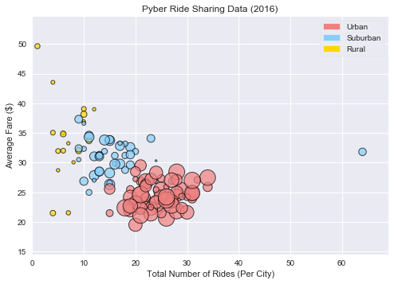

# Pyber

This is an analysis of the ride sharing success using data from competitors as guidance for new opportunities for market differentiation.  This analysis will use 4 key variables (Fare, Number of Rides, Number of Drivers, City Type).

* The study found that people in the urban areas utilize the use of ride sharing the most (67.5%) and the least in rural areas (6.6%)
* The concentration of drivers in the rural areas are the lowest (1.0%) which might account to why ridership in those areas are very low (5.2%).
* Despite that the average fare in the urban areas are lower than those in the suburban areas, the number of riders that use ride sharing in the urban areas account for the high total fares (62%).


```python
import pandas as pd
import numpy as np
import matplotlib.pyplot as plt
import matplotlib.patches as mpatches
import seaborn as sns
```


```python
# define data inputs
city_data = "Resources/city_data.csv"
ride_data = "Resources/ride_data.csv"
```


```python
# open city data and replace all NaN, if any
city_orig_pd = pd.read_csv(city_data)
city_orig_pd.fillna(0, inplace=True)
city_orig_pd[city_orig_pd['city'] == "Port James"]
```


<div>
<style>
    .dataframe thead tr:only-child th {
        text-align: right;
    }

    .dataframe thead th {
        text-align: left;
    }

    .dataframe tbody tr th {
        vertical-align: top;
    }
</style>
<table border="1" class="dataframe">
  <thead>
    <tr style="text-align: right;">
      <th></th>
      <th>city</th>
      <th>driver_count</th>
      <th>type</th>
    </tr>
  </thead>
  <tbody>
    <tr>
      <th>84</th>
      <td>Port James</td>
      <td>15</td>
      <td>Suburban</td>
    </tr>
    <tr>
      <th>100</th>
      <td>Port James</td>
      <td>3</td>
      <td>Suburban</td>
    </tr>
  </tbody>
</table>
</div>


```python
# define array of colors to use
colors = ['gold', 'lightskyblue', 'lightcoral']

# define city types
citytype = ['Rural', 'Suburban', 'Urban']
```


```python
# open ride data and replace all NaN, if any
ride_orig_pd = pd.read_csv(ride_data)
ride_orig_pd.fillna(0, inplace=True)
ride_orig_pd.head()
```


<div>
<style>
    .dataframe thead tr:only-child th {
        text-align: right;
    }

    .dataframe thead th {
        text-align: left;
    }

    .dataframe tbody tr th {
        vertical-align: top;
    }
</style>
<table border="1" class="dataframe">
  <thead>
    <tr style="text-align: right;">
      <th></th>
      <th>city</th>
      <th>date</th>
      <th>fare</th>
      <th>ride_id</th>
    </tr>
  </thead>
  <tbody>
    <tr>
      <th>0</th>
      <td>Sarabury</td>
      <td>2016-01-16 13:49:27</td>
      <td>38.35</td>
      <td>5403689035038</td>
    </tr>
    <tr>
      <th>1</th>
      <td>South Roy</td>
      <td>2016-01-02 18:42:34</td>
      <td>17.49</td>
      <td>4036272335942</td>
    </tr>
    <tr>
      <th>2</th>
      <td>Wiseborough</td>
      <td>2016-01-21 17:35:29</td>
      <td>44.18</td>
      <td>3645042422587</td>
    </tr>
    <tr>
      <th>3</th>
      <td>Spencertown</td>
      <td>2016-07-31 14:53:22</td>
      <td>6.87</td>
      <td>2242596575892</td>
    </tr>
    <tr>
      <th>4</th>
      <td>Nguyenbury</td>
      <td>2016-07-09 04:42:44</td>
      <td>6.28</td>
      <td>1543057793673</td>
    </tr>
  </tbody>
</table>
</div>


```python
merged_pd = city_orig_pd.merge(ride_orig_pd, on="city", how="left")
merged_renamed_final = merged_pd[['city','date','fare','ride_id','driver_count','type']]

merged_renamed_final.head()
```


<div>
<style>
    .dataframe thead tr:only-child th {
        text-align: right;
    }

    .dataframe thead th {
        text-align: left;
    }

    .dataframe tbody tr th {
        vertical-align: top;
    }
</style>
<table border="1" class="dataframe">
  <thead>
    <tr style="text-align: right;">
      <th></th>
      <th>city</th>
      <th>date</th>
      <th>fare</th>
      <th>ride_id</th>
      <th>driver_count</th>
      <th>type</th>
    </tr>
  </thead>
  <tbody>
    <tr>
      <th>0</th>
      <td>Kelseyland</td>
      <td>2016-08-19 04:27:52</td>
      <td>5.51</td>
      <td>6246006544795</td>
      <td>63</td>
      <td>Urban</td>
    </tr>
    <tr>
      <th>1</th>
      <td>Kelseyland</td>
      <td>2016-04-17 06:59:50</td>
      <td>5.54</td>
      <td>7466473222333</td>
      <td>63</td>
      <td>Urban</td>
    </tr>
    <tr>
      <th>2</th>
      <td>Kelseyland</td>
      <td>2016-05-04 15:06:07</td>
      <td>30.54</td>
      <td>2140501382736</td>
      <td>63</td>
      <td>Urban</td>
    </tr>
    <tr>
      <th>3</th>
      <td>Kelseyland</td>
      <td>2016-01-25 20:44:56</td>
      <td>12.08</td>
      <td>1896987891309</td>
      <td>63</td>
      <td>Urban</td>
    </tr>
    <tr>
      <th>4</th>
      <td>Kelseyland</td>
      <td>2016-08-09 18:19:47</td>
      <td>17.91</td>
      <td>8784212854829</td>
      <td>63</td>
      <td>Urban</td>
    </tr>
  </tbody>
</table>
</div>


```python
# ride_info_df = merged
ride_types_group = merged_pd.groupby(['type','city'])
driver_count = ride_types_group['driver_count'].max()
city_types =  ride_types_group['type'].max()
averagefares = ride_types_group['fare'].mean()
ride_count = ride_types_group['ride_id'].count()

city_df = pd.DataFrame({
    "type": city_types,
    "Driver Count" : driver_count,
    "Average Fare" : averagefares,
    "Number of Rides" : ride_count})

city_df.head()
```


<div>
<style>
    .dataframe thead tr:only-child th {
        text-align: right;
    }

    .dataframe thead th {
        text-align: left;
    }

    .dataframe tbody tr th {
        vertical-align: top;
    }
</style>
<table border="1" class="dataframe">
  <thead>
    <tr style="text-align: right;">
      <th></th>
      <th></th>
      <th>Average Fare</th>
      <th>Driver Count</th>
      <th>Number of Rides</th>
      <th>type</th>
    </tr>
    <tr>
      <th>type</th>
      <th>city</th>
      <th></th>
      <th></th>
      <th></th>
      <th></th>
    </tr>
  </thead>
  <tbody>
    <tr>
      <th rowspan="5" valign="top">Rural</th>
      <th>East Leslie</th>
      <td>33.660909</td>
      <td>9</td>
      <td>11</td>
      <td>Rural</td>
    </tr>
    <tr>
      <th>East Stephen</th>
      <td>39.053000</td>
      <td>6</td>
      <td>10</td>
      <td>Rural</td>
    </tr>
    <tr>
      <th>East Troybury</th>
      <td>33.244286</td>
      <td>3</td>
      <td>7</td>
      <td>Rural</td>
    </tr>
    <tr>
      <th>Erikport</th>
      <td>30.043750</td>
      <td>3</td>
      <td>8</td>
      <td>Rural</td>
    </tr>
    <tr>
      <th>Hernandezshire</th>
      <td>32.002222</td>
      <td>10</td>
      <td>9</td>
      <td>Rural</td>
    </tr>
  </tbody>
</table>
</div>


```python
fig = plt.figure()
ax = fig.add_subplot(1,1,1)
ax.scatter(city_df['Number of Rides'],city_df['Average Fare'], s=city_df['Driver Count']*6, marker="o",facecolor=city_df.type.map({citytype[2]: colors[2], citytype[0]: colors[0], citytype[1]: colors[1]}), alpha=0.7, edgecolors="black", linewidth=1) 
handles, labels = ax.get_legend_handles_labels()
u_patch = mpatches.Patch(color=colors[2], label=citytype[2])
s_patch = mpatches.Patch(color=colors[1], label=citytype[1])
r_patch = mpatches.Patch(color=colors[0], label=citytype[0])
plt.legend(handles=[u_patch, s_patch, r_patch], frameon=True, loc="upper right")


ax.set_title('Pyber Ride Sharing Data (2016)')
ax.set_xlabel('Total Number of Rides (Per City)')
ax.set_ylabel('Average Fare ($)')
ax.set_xlim(0, city_df['Number of Rides'].max()+5)
ax.set_ylim(city_df['Average Fare'].min()-5, (city_df['Average Fare'].max() + 5))
plt.show()
```





## Total Fares by City Type


```python
# find total fare by type
fares_df = merged_pd.groupby(['type']).aggregate({'fare':'sum'})
fares_df
```


<div>
<style>
    .dataframe thead tr:only-child th {
        text-align: right;
    }

    .dataframe thead th {
        text-align: left;
    }

    .dataframe tbody tr th {
        vertical-align: top;
    }
</style>
<table border="1" class="dataframe">
  <thead>
    <tr style="text-align: right;">
      <th></th>
      <th>fare</th>
    </tr>
    <tr>
      <th>type</th>
      <th></th>
    </tr>
  </thead>
  <tbody>
    <tr>
      <th>Rural</th>
      <td>4255.09</td>
    </tr>
    <tr>
      <th>Suburban</th>
      <td>20335.69</td>
    </tr>
    <tr>
      <th>Urban</th>
      <td>40078.34</td>
    </tr>
  </tbody>
</table>
</div>


```python
# Data to plot
labels = fares_df.index.tolist()
plt.figure()
explode = (0.0, 0.0, 0.1)  # explode 1st slice
 
# # Plot
plt.pie(fares_df['fare'], explode=explode, labels=labels, colors=colors,
        autopct='%1.1f%%', shadow=True, startangle=140)


plt.title("% of Total Fare by City Type") 
plt.show()
```


## Total Rides by City Type


```python
rides_df = merged_pd.groupby(['type']).aggregate({'ride_id':'count'})
rides_df
```


<div>
<style>
    .dataframe thead tr:only-child th {
        text-align: right;
    }

    .dataframe thead th {
        text-align: left;
    }

    .dataframe tbody tr th {
        vertical-align: top;
    }
</style>
<table border="1" class="dataframe">
  <thead>
    <tr style="text-align: right;">
      <th></th>
      <th>ride_id</th>
    </tr>
    <tr>
      <th>type</th>
      <th></th>
    </tr>
  </thead>
  <tbody>
    <tr>
      <th>Rural</th>
      <td>125</td>
    </tr>
    <tr>
      <th>Suburban</th>
      <td>657</td>
    </tr>
    <tr>
      <th>Urban</th>
      <td>1625</td>
    </tr>
  </tbody>
</table>
</div>


```python
# Data to plot
labels = rides_df.index.tolist()
explode = (0.0, 0.0, 0.1)  # explode 1st slice
 
# # Plot
plt.pie(rides_df['ride_id'], explode=explode, labels=labels, colors=colors,
        autopct='%1.1f%%', shadow=True, startangle=140)

plt.title("% of Total Rides by City Type") 
plt.show()
```


## Total Drivers by City Type


```python
drivers_df = city_orig_pd.groupby(['type']).aggregate({'driver_count':'sum'})
drivers_df
```


<div>
<style>
    .dataframe thead tr:only-child th {
        text-align: right;
    }

    .dataframe thead th {
        text-align: left;
    }

    .dataframe tbody tr th {
        vertical-align: top;
    }
</style>
<table border="1" class="dataframe">
  <thead>
    <tr style="text-align: right;">
      <th></th>
      <th>driver_count</th>
    </tr>
    <tr>
      <th>type</th>
      <th></th>
    </tr>
  </thead>
  <tbody>
    <tr>
      <th>Rural</th>
      <td>104</td>
    </tr>
    <tr>
      <th>Suburban</th>
      <td>638</td>
    </tr>
    <tr>
      <th>Urban</th>
      <td>2607</td>
    </tr>
  </tbody>
</table>
</div>


```python
# Data to plot
labels = drivers_df.index.tolist()
explode = (0.0, 0.0, 0.1) 
 

# # Plot
plt.pie(drivers_df['driver_count'], explode=explode, labels=labels, colors=colors,
        autopct='%1.1f%%', shadow=True, startangle=140)


plt.title("% of Total Drivers by City Type") 
plt.show()
```


